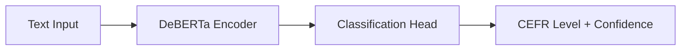

# CEFR Classifier Training

Fine-tune a DeBERTa model for CEFR level classification using [Modal](https://modal.com/) cloud GPUs.

**Published Model:** [`robg/speako-cefr-deberta`](https://huggingface.co/robg/speako-cefr-deberta)

## Quick Start

```bash
# 1. Install Modal CLI
pip install modal
modal token new

# 2. Start Training
modal run ml/train_cefr_deberta.py

# 3. Retrieve Trained Model (Optional)
npx tsx scripts/download-modal-model.ts
```

## Model Details

| Property | Value |
|----------|-------|
| Base Model | [`microsoft/deberta-v3-small`](https://huggingface.co/microsoft/deberta-v3-small) |
| HuggingFace ID | [`robg/speako-cefr-deberta`](https://huggingface.co/robg/speako-cefr-deberta) |
| Parameters | ~44M |
| ONNX Size | ~90MB (quantized) |
| Labels | A1, A2, B1, B2, C1, C2 |
| Max Length | 256 tokens |
| Task | `text-classification` |

## Architecture



The model uses DeBERTa-v3-small as the base encoder with a 6-class classification head for CEFR levels.

## Training Data

### License Compliance

> [!IMPORTANT]
> The training uses only openly-licensed data to ensure the published model complies with all licenses.

| Data Source | License | Usage |
|-------------|---------|-------|
| [UniversalCEFR](https://huggingface.co/datasets/lksenel/UniversalCEFR) | CC-BY-NC-4.0 | **Training** |
| [S&I Corpus 2025](https://www.englishlanguageitutoring.com/datasets/speak-and-improve-corpus-2025) | Restrictive | Validation only |

The CC-BY-NC-4.0 license explicitly allows creating derivative models for non-commercial use.

---

### Training: UniversalCEFR

[UniversalCEFR](https://huggingface.co/datasets/lksenel/UniversalCEFR) is a large-scale multilingual dataset with 500k+ CEFR-labeled texts.

- **Paper**: [arXiv:2404.00813](https://arxiv.org/abs/2404.00813)
- **License**: CC-BY-NC-4.0 (allows derivative models)
- **Languages**: 13 (filtered to English only)
- **Levels**: A1–C2

> [!TIP]
> Long texts are automatically chunked (5-50 words) to match speech transcript lengths and prevent the model from learning "long text = high CEFR".

---

### Validation: Speak & Improve Corpus 2025

The [S&I Corpus](https://www.englishlanguageitutoring.com/datasets/speak-and-improve-corpus-2025) is used **only for evaluation**, not training.

| File | Purpose | Samples |
|------|---------|---------|
| `eval-asr.stm` | Held-out test | ~9,200 |

> [!CAUTION]
> The S&I license prohibits releasing models **derived from** the corpus. Since validation data doesn't influence model weights, using it for evaluation is permitted under the non-commercial research clause.

## Data Augmentation

The training script applies noise augmentation to simulate ASR transcription errors:

| Augmentation | Probability | Example |
|--------------|-------------|---------|
| Character swap | 5% | `speaking` → `spekaing` |
| Character deletion | 3% | `speaking` → `speaing` |
| Word deletion (short words) | 3% | `I am going` → `am going` |

This helps the model generalize to imperfect Whisper transcriptions.

## Training Configuration

| Parameter | Value |
|-----------|-------|
| GPU | NVIDIA T4 |
| Batch Size | 64 |
| Learning Rate | 2e-5 |
| Epochs | 4 (with early stopping) |
| Max Samples | 60,000 |
| Mixed Precision | FP16 |
| Early Stopping | Patience 2 epochs |
| Metric | Weighted F1 |

## Files

| File | Description |
|------|-------------|
| [`train_cefr_deberta.py`](./train_cefr_deberta.py) | Main training script (Modal) |
| [`cefr_utils.py`](./cefr_utils.py) | Data parsing and augmentation utilities |

## Browser Integration

The model is automatically loaded in the browser when users start recording or run validation:

```
Loading CEFR Classifier with WEBGPU...
CEFR Classifier loaded successfully with WEBGPU!
[MetricsCalculator] ML CEFR prediction: B2 (87.3%)
```

### Loading Behavior

1. **WebGPU** is preferred for fast inference
2. **WASM** fallback if WebGPU unavailable or fails
3. Model is cached in browser for subsequent visits

## Troubleshooting

### Model not loading in browser?

- Check browser console for errors
- Ensure internet connection (model downloads from HuggingFace)
- Verify WebGPU support: `navigator.gpu` in console
- Model will fallback to WASM if WebGPU fails

### Training fails on Modal?

```bash
# Check logs
modal app logs cefr-deberta-training

# Verify S&I validation data exists (optional)
ls test-data/reference-materials/stms/
```

### Common errors

| Error | Solution |
|-------|----------|
| `ModuleNotFoundError: cefr_utils` | Ensure `ml/cefr_utils.py` exists |
| `STM file not found` | Symlink `test-data` to S&I corpus directory (optional for validation) |
| `CUDA out of memory` | Reduce `batch_size` parameter |
| `Failed to load UniversalCEFR` | Check internet connection (dataset downloads from HuggingFace) |

## References

- [DeBERTa Paper](https://arxiv.org/abs/2006.03654) – Decoding-enhanced BERT with Disentangled Attention
- [Modal Documentation](https://modal.com/docs) – Serverless GPU compute
- [CEFR Framework](https://www.coe.int/en/web/common-european-framework-reference-languages) – Common European Framework of Reference
- [UniversalCEFR Dataset](https://huggingface.co/datasets/lksenel/UniversalCEFR) – Training data (CC-BY-NC-4.0)
- [Speak & Improve Corpus 2025](https://doi.org/10.17863/CAM.114333) – Validation data
